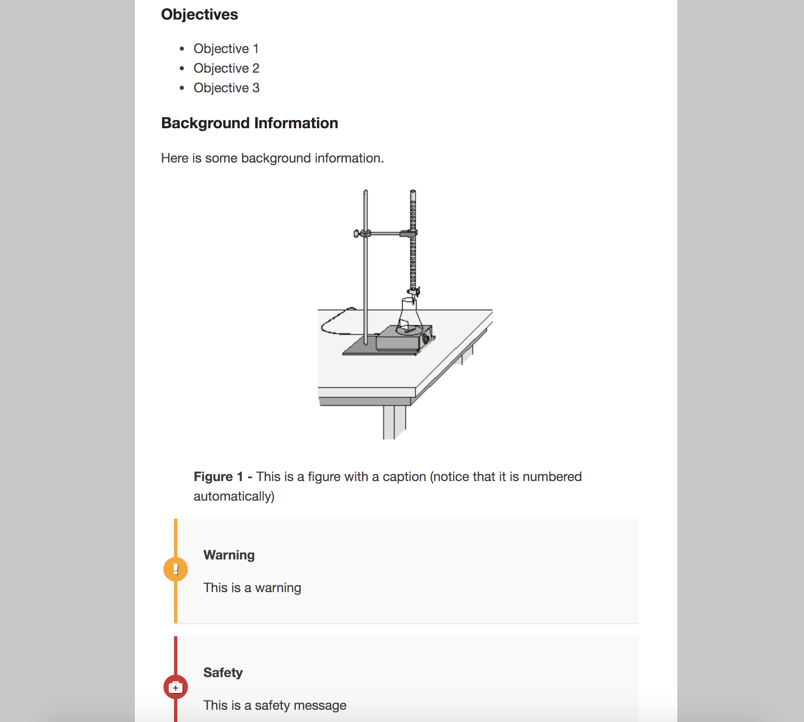
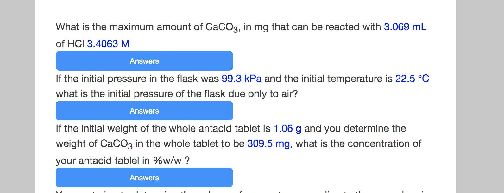

# LAB Manuals

This is an html, css project on how to design good looking laboratory manuals with function to print.
And to have some fun, there is a quiz!

## Screenshot

## Installation

Since this is an html, css project there is no actual instalation requirements other than having a browser.

## Contributing
Pull requests are welcome. For major changes, please open an issue first to discuss what you would like to change.

Please make sure to update tests as appropriate.
